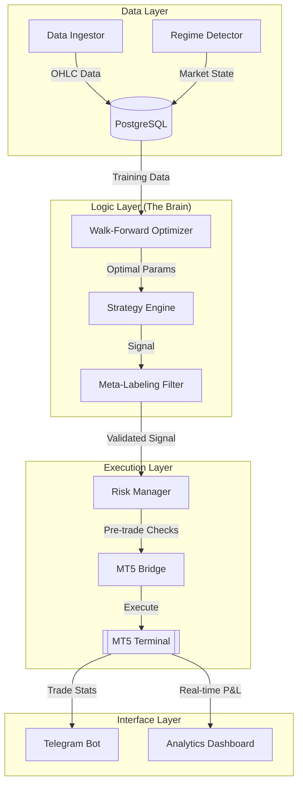

# TradePanel: System Architecture & Workflow

## 1. Executive Summary
TradePanel is a high-performance, institutional-grade algorithmic trading platform integrated with MetaTrader 5 (MT5). The platform operates on a **Quantitative Portfolio** model, managing dozens of concurrent strategies that are dynamically tiered based on real-time market regimes and Walk-Forward Optimization (WFO) results.

---

## 2. Technical Architecture

### 2.1 Component Stack
- **Core Engine:** Python 3.12+ (Asyncio / Multiprocessing)
- **Database:** PostgreSQL (Historical market data, trade journals, regime logs)
- **Interface:** MetaTrader 5 Terminal (Bridge via `MetaTrader5` Python library)
- **Observability:** Telegram Bot API & Fast API Glassmorphic Dashboard
- **Infrastructure:** Docker Desktop (Optional stack for WAHA/WA services)

### 2.2 High-Level Diagram

---

## 3. End-to-End Workflow

### Phase 1: Research & Optimization (WFO)
The **Walk-Forward Optimizer** is the "Scientific Core" of the platform. Instead of simple backtesting, it uses a rolling window approach:
1. **In-Sample (IS):** Grid search finds the best parameters for a 3-month window.
2. **Out-of-Sample (OOS):** These parameters are tested on the *following* month of data (which the optimizer has never seen).
3. **Pass/Fail:** A strategy only moves to production if it passes **70%+** of its OOS windows with a positive Sharpe Ratio.

### Phase 2: Market Intelligence (Regime Detection)
The system does not trade blindly. The `RegimeDetector` classifies every instrument every hour:
- **Trending:** High ADX, EMA alignment. (Targeted by Trend strategies).
- **Ranging:** Low ADX, Bollinger Band containment. (Targeted by Mean-Reversion).
- **Volatile:** ATR expansion. (Used for risk-off signals).

### Phase 3: The "Decision Gate" (Risk Management)
When a strategy generates a signal, it must pass a "Gauntlet" of checks:
1. **Regime Match:** Ensure the strategy category matches the current market state.
2. **Meta-Labeling:** Secondary momentum/volume validation (RSI > 55 for longs, 1.2x Vol).
3. **Correlation Check:** Ensure the portfolio isn't over-exposed to a single currency (e.g., USD).
4. **Account Safety:** Margin check + Max Concurrent positions check.

### Phase 4: Execution & Monitoring
Trades are executed as **Limit or Market Orders** with ATR-based Stop Losses. The system then enters a persistent monitoring loop:
- **Telegram:** Instant alerts for Entry, Partial TP, Break-Even (BE) adjustments, and Exit.
- **Dashboard:** Real-time equity curve and performance metrics (Sharpe, Profit Factor, Recovery Factor).

---

## 4. Design Philosophy
- **Glassmorphism:** The UI and notifications follow a premium, translucent design language for high visual impact.
- **Fail-Safe Operation:** Decoupled heartbeat systems ensure that if the MT5 terminal crashes, the Telegram bot immediately alerts the operator.
- **Data Integrity:** No "look-ahead bias." All backtests and WFO runs strictly execute on the `bar[i+1]` Open after a signal fires on the `bar[i]` Close.

---

## 5. Maintenance Schedule (Automated)
| Time (UTC) | Task | Purpose |
|------------|------|---------|
| 00:05 | Daily Data Sync | Update DB with yesterday's close |
| 02:00 | Overnight WFO | Re-optimize parameters for the new day |
| 06:00 | Strategy Tiering | Promote/Demote strategies based on WFO |
| 08:00 | Heartbeat | System health status report to Telegram |

---
*Created: 2026-04-30 | Stability Update v2.1*
