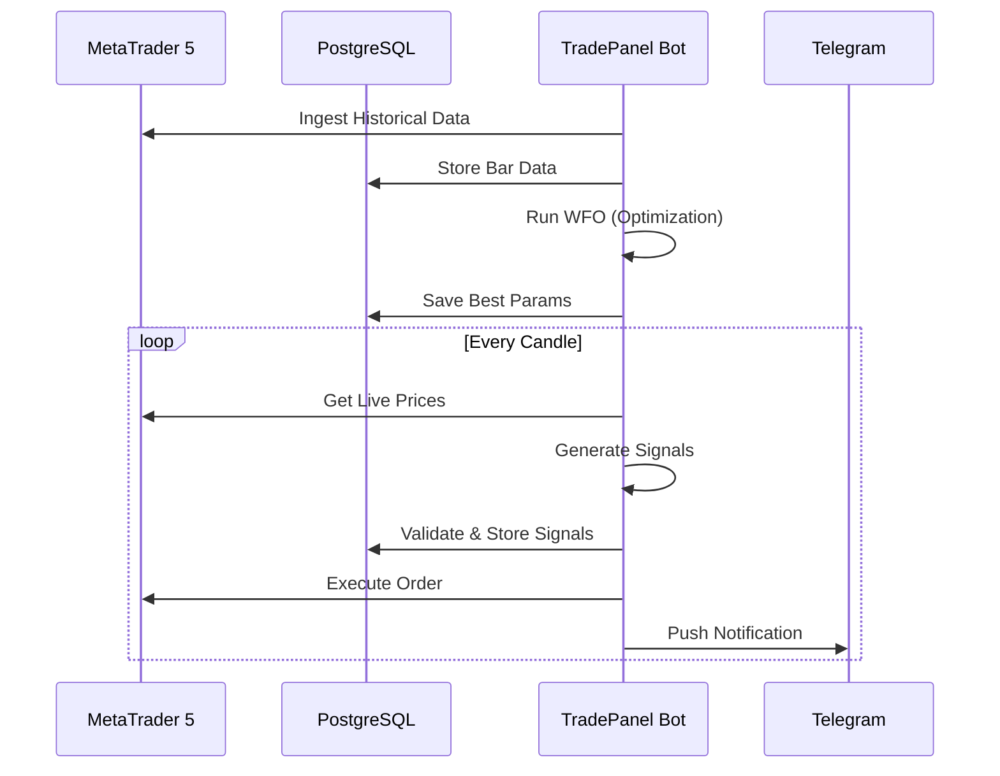

# 🏛️ APPLICATION ARCHITECTURE

**TradePanel** is a modular algorithmic trading framework built for MetaTrader 5. It follows a layered architecture to ensure separation of concerns between data ingestion, strategy logic, and order execution.

## 🧱 Logic Layers

### 1. Data Layer (PostgreSQL)
*   **market_data**: Stores OHLCV bars for all configured pairs and timeframes.
*   **trades**: Persistent log of all executed trades and their outcomes.
*   **signals**: Historical record of every signal generated, used for deduplication.
*   **bot_health**: Event logs for monitoring and alerting (Heartbeats, Errors).

### 2. Strategy Layer (LeoDeX V2)
All strategies inherit from `BaseStrategy` and provide a `generate_signals(df)` method.
*   **Categories**: Institutional, Trend Following, Mean Reversion, Breakout, Advanced.
*   **Ensemble Engine**: Logic to combine multiple strategies for higher-probability entries.

### 3. Optimization Layer (WFO Suite)
*   **Walk-Forward Optimizer**: Rolling window testing (In-Sample / Out-of-Sample).
*   **Master Suite**: Automated validation of the entire 25-strategy portfolio.

### 4. Execution Layer (MT5 Bridge)
*   **Paper Engine**: Simulates execution against live prices with realistic slippage.
*   **Order Manager**: Translates internal signals into MT5 orders with 3-stage Take Profit logic.

### 5. Monitoring Layer (Telegram)
*   **Notification Router**: Real-time alerts for trades, drawdown, and system health.
*   **Interactive Bot**: Allows querying account status and manual strategy toggle.

## 🔄 Deployment Flow

## 📂 Project Structure

*   `/backtesting`: Core logic for historical validation.
*   `/config`: YAML definitions for pairs and strategies.
*   `/data`: Database clients and data scrapers.
*   `/forward_test`: Real-time signal checking and paper engine.
*   `/logging_`: System-wide event logging and archiving.
*   `/mt5_bridge`: Direct API interface with the MT5 terminal.
*   `/scripts`: Operational utilities for setup and optimization.
*   `/strategies`: Implementation of all 25 trading logics.

---
*Back to [GETTING_STARTED.md](GETTING_STARTED.md).*
