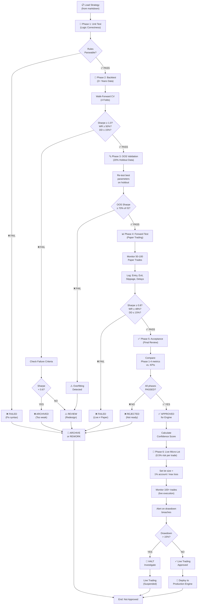

# Strategy Test Workflow & Validation Framework

## 6-Phase Testing Progression

```
START → Phase 1 → Phase 2 → Phase 3 → Phase 4 → Phase 5 → Phase 6 → LIVE
        ↓         ↓         ↓         ↓         ↓         ↓
      UNIT     BACKTEST   OOS       FORWARD    ACCEPT    MICRO
      TEST     2+ YEARS   HOLDOUT   PAPER      DECISION  LIVE
                          20%       50-100     ALL PASS  100+
                          DATA      TRADES     ?         TRADES
```

## Detailed Test Workflow Diagram



---

## Phase-by-Phase Checklist

### ✅ Phase 1: Unit Test (1 hour)

**Objective:** Verify entry/exit logic is programmatically correct

**AI Checks:**
- [ ] All entry rules are parseable (no syntax errors)
- [ ] All exit rules are parseable (no syntax errors)
- [ ] All parameters have [Min..Max] bounds
- [ ] No undefined indicators or variables
- [ ] Exit logic references valid entry signals

**Success Criteria:**
- [ ] Zero syntax errors
- [ ] All rules execute without NaN/NULL values
- [ ] Sample data produces expected signals

**Failure Actions:**
- ❌ Fix syntax; retry Phase 1
- ❌ Archive if unfixable

---

### ✅ Phase 2: Backtesting (4 hours)

**Objective:** Run 2+ years historical data with walk-forward analysis

**Data Requirements:**
- Minimum 2 years of H1/H4/D1 OHLC data
- 100,000+ candles (sufficient for parameter optimization)
- Clean data: no gaps, outliers, or data quality issues

**AI Responsibilities:**
1. Auto-optimize parameters within [Min..Max] bounds
2. Run 4-fold walk-forward cross-validation (no curve-fitting)
3. Apply realistic slippage (2–5 pips) and commission
4. Plot equity curves for each fold
5. Calculate metrics: Sharpe, win rate, max DD, trades, etc.
6. Identify overfitting (OOS Sharpe < 70% of IS)

**Success Criteria:**
- ✅ Win Rate ≥ 50%
- ✅ Sharpe Ratio ≥ 1.0
- ✅ Max Drawdown ≤ 15%
- ✅ Minimum 50 trades
- ✅ Monthly return ≥ 1%

**Failure Actions:**
- ❌ Sharpe < 0.6 → ARCHIVE (too weak)
- ❌ Win rate < 45% → ABANDON (no edge)
- ❌ Drawdown > 20% → REDESIGN (risk too high)
- ⚠️ Otherwise → REVIEW (investigate failures)

---

### ✅ Phase 3: Out-of-Sample Validation (2 hours)

**Objective:** Test on 20% held-out data (no optimization)

**Data Split:**
- 80% for training/optimization (Phase 2)
- 20% for validation (Phase 3) — never touched in Phase 2

**AI Responsibilities:**
1. Load best parameters from Phase 2
2. Re-test on held-out 20% data
3. Compare OOS metrics to in-sample metrics
4. Calculate metric degradation (should be < 30%)
5. Flag if metrics diverge > 3σ from backtest

**Success Criteria:**
- ✅ OOS Sharpe ≥ 70% of IS Sharpe
- ✅ Win rate degradation < 3%
- ✅ No parameter re-optimization on holdout

**Failure Actions:**
- ❌ OOS Sharpe < 70% of IS → OVERFITTING DETECTED
  - Reduce complexity
  - Simplify parameters
  - Retry Phase 2 with fewer optimizations

---

### ✅ Phase 4: Forward Testing (4 weeks)

**Objective:** Paper trade 50–100 real trades, log all metrics

**Setup:**
- Use paper trading account (simulator or broker demo)
- Trade with real market conditions (slippage, spreads, liquidity)
- Log every trade: entry time, entry price, exit time, exit price, actual slippage
- Monitor daily; update performance dashboard

**AI Responsibilities:**
1. Monitor paper trades 24/7 (or during liquid hours)
2. Log all trade details + execution metrics
3. Alert on: slippage > threshold, liquidity issues, execution delays
4. Track daily equity, drawdown, win-rate evolution
5. Generate daily/weekly performance report
6. Detect divergence from backtest (red flag)

**Success Criteria:**
- ✅ Win Rate ≥ 48% (slightly relaxed)
- ✅ Sharpe Ratio ≥ 0.8 (slippage + spreads impact)
- ✅ Max Drawdown ≤ 15%
- ✅ Minimum 30–50 trades
- ✅ Metrics consistent with Phase 2 backtest

**Failure Actions:**
- ❌ Forward test Sharpe << backtest Sharpe → INVESTIGATE
  - Check slippage assumptions
  - Validate data quality
  - Confirm execution (no bugs)
- ❌ Win rate < 45% → HALT & REVIEW

---

### ✅ Phase 5: Acceptance Decision (2 hours)

**Objective:** Final review of all 4 phases; make PASS/FAIL decision

**AI Responsibilities:**
1. Compare all 4 phases side-by-side
   - Backtest metrics (IS)
   - Out-of-sample metrics
   - Forward-test metrics (paper trading)
2. Check consistency: Are metrics stable across phases?
3. Calculate confidence score (0–1) based on metric stability
4. Recommend PASS/FAIL + confidence level
5. Document any red flags or areas of concern

**Confidence Score Formula:**
```
confidence = 1.0 - (metric_std / metric_avg)
where metric = Sharpe ratios across [IS, OOS, paper]

Example:
  IS Sharpe = 1.25
  OOS Sharpe = 0.88 (70% of IS)
  Paper Sharpe = 0.82
  
  avg_sharpe = (1.25 + 0.88 + 0.82) / 3 = 0.98
  std_sharpe = 0.20
  confidence = 1.0 - (0.20 / 0.98) = 0.80 (80%)
```

**Success Criteria:**
- ✅ Phase 1 PASSED (logic correct)
- ✅ Phase 2 PASSED (backtest strong)
- ✅ Phase 3 PASSED (OOS stable)
- ✅ Phase 4 PASSED (paper trading consistent)
- ✅ Confidence score ≥ 75%
- ✅ No major red flags

**Failure Actions:**
- ❌ Any phase FAILED → REJECTED (not ready)
- ❌ Confidence < 75% → CONDITIONAL APPROVAL (with caveats)

---

### ✅ Phase 6: Live Micro-Lot Trading (6 weeks)

**Objective:** Risk 0.5% account per trade, monitor for 100+ trades

**Setup:**
- Calculate micro-lot size = (1% account) / (max loss per trade)
- Example: $10,000 account, 50-pip stop → micro-lot = 20
- Start with smallest position size
- Monitor 24/7; alert on drawdown breaches

**AI Responsibilities:**
1. Calculate and set micro-lot size
2. Monitor live trades every bar (capture real execution)
3. Log: actual slippage, fill prices, latency
4. Alert if drawdown > 15% threshold
5. Compare live metrics to paper baseline
6. Auto-halt trading if performance degrades

**Success Criteria:**
- ✅ Win rate ≥ 45% (relaxed due to live conditions)
- ✅ Sharpe ≥ 0.70 (consistency)
- ✅ Equity drawdown never > 15%
- ✅ Live metrics within ±15% of paper metrics

**Failure Actions:**
- ❌ Drawdown > 15% → AUTO-HALT (stop trading)
- ❌ Live performance << paper → INVESTIGATE
  - Check broker fills
  - Validate market conditions
  - Confirm algo execution
- ❌ Win rate < 40% for 100 trades → DISABLE & REVIEW

---

## Key Metrics Reference

### Profitability Metrics
| Metric | Formula | Target | Notes |
|--------|---------|--------|-------|
| **Win Rate** | # Wins / Total Trades | ≥50% | Percentage of profitable trades |
| **Avg R:R** | Avg Profit / Avg Loss | ≥1:1.5 | Risk-reward ratio |
| **Sharpe Ratio** | (Return - RFR) / StdDev | ≥1.0 | Risk-adjusted return |
| **Sortino Ratio** | Return / DownsideStdDev | ≥0.8 | Return per downside risk |
| **Profit Factor** | Gross Profit / Gross Loss | ≥1.5 | Total wins vs. total losses |
| **Recovery Factor** | Net Profit / Max Drawdown | ≥2.0 | Profit relative to max loss |
| **Monthly Return** | Avg Monthly % | ≥1% | Monthly risk-adjusted return |

### Risk Metrics
| Metric | Formula | Target | Notes |
|--------|---------|--------|-------|
| **Max Drawdown** | Peak-to-Trough Decline | ≤15% | Largest loss from peak |
| **Avg Drawdown** | Avg of all DD periods | ≤8% | Average loss from peaks |
| **Consecutive Losses** | Max losing streak | ≤5 trades | Longest losing run |
| **Volatility** | StdDev of returns | <10% | Return variability |
| **VaR (Value at Risk)** | 95th percentile loss | <5% | Worst 5% days loss |

### Consistency Metrics
| Metric | Formula | Target | Notes |
|--------|---------|--------|-------|
| **Sharpe (Monthly)** | Monthly Sharpe | Consistent | Month-by-month stability |
| **Win Rate by Regime** | % wins in trend vs. range | ±5% | Performance across regimes |
| **Trade Frequency** | Avg trades per month | 5–15 | Setup frequency |
| **Slippage Impact** | % of profit lost | <20% | Execution quality |

---

## Validation Flow: Code Example

```python
from strategy_validator import StrategyValidator, TestPhase

# Initialize
validator = StrategyValidator('validation_config.yaml')
validator.load_strategies('strategies_structured.md')

# Run full pipeline
results = validator.run_full_test_pipeline()

# Check results
for strategy_name, phase_results in results.items():
    phases_passed = sum(1 for r in phase_results if r.status == 'PASSED')
    
    if phases_passed == 4:  # All 4 main phases passed
        print(f"✅ {strategy_name} APPROVED for engine")
    else:
        print(f"❌ {strategy_name} REJECTED")
        for result in phase_results:
            if result.status != 'PASSED':
                print(f"  - {result.phase}: {result.errors}")

# Generate report
validator.generate_report('validation_report.json')
validator.print_summary()
```

---

## Failure Decision Tree

```
Does strategy have syntax errors?
├─ YES → Fix and retry Phase 1
└─ NO → Continue to Phase 2

Backtest Sharpe < 0.6?
├─ YES → ARCHIVE (too weak)
└─ NO → Continue to Phase 3

Backtest win rate < 45%?
├─ YES → ABANDON (no edge)
└─ NO → Continue to Phase 3

OOS Sharpe < 70% of IS Sharpe?
├─ YES → OVERFITTING (redesign)
└─ NO → Continue to Phase 4

Forward test Sharpe < 0.8?
├─ YES → INVESTIGATE (data/execution issue)
└─ NO → Continue to Phase 5

All phases 1-4 PASSED?
├─ YES → APPROVED (Phase 6: micro-live)
└─ NO → REJECTED (not ready for engine)

Live trading drawdown > 15%?
├─ YES → HALT (auto-disable)
└─ NO → Continue live trading ✓
```

---

## Deployment Checklist

Before adding strategy to production engine:

- [ ] Phase 1 PASSED (logic correct)
- [ ] Phase 2 PASSED (backtest Sharpe ≥ 1.0)
- [ ] Phase 3 PASSED (OOS Sharpe ≥ 70% of IS)
- [ ] Phase 4 PASSED (forward test Sharpe ≥ 0.8)
- [ ] Phase 5 PASSED (acceptance decision)
- [ ] Confidence score ≥ 75%
- [ ] Parameter bounds locked (no further optimization)
- [ ] Slippage assumptions validated
- [ ] Drawdown thresholds set + alerts configured
- [ ] Daily monitoring script deployed
- [ ] Fallback/disable logic configured
- [ ] Documentation for maintainers completed
- [ ] Strategy added to engine config
- [ ] Test live trading with micro-lot (Phase 6)
- [ ] Production deployment approved

---

## Files in Validation Folder

```
/validation/
├── strategies_structured.md       # All 10 strategies (structured format)
├── validation_config.yaml         # Acceptance criteria + test config
├── test_runner.py                 # Python script to run full pipeline
├── test_workflow.md               # This file (workflow + diagrams)
├── README.md                      # Quick start guide
├── validation_report.json         # Generated after test run
├── strategy_validation.log        # Test execution log
└── archive/
    ├── disabled_strategies/       # Archived failed strategies
    └── test_results/              # Historical test results
```

---

## Running the Validation

```bash
# Install dependencies
pip install pyyaml

# Run full validation pipeline
python test_runner.py

# View results
cat validation_report.json
tail -f strategy_validation.log
```

---

## Next Steps

1. ✅ Load all 10 strategies from `strategies_structured.md`
2. ✅ Run Phase 1 (Unit Test) for each
3. ✅ Run Phase 2 (Backtest) for passed strategies
4. ✅ Run Phase 3 (OOS) for passed strategies
5. ✅ Run Phase 4 (Forward Test) for approved strategies
6. ✅ Run Phase 5 (Acceptance) for all phases
7. ✅ Add approved strategies to trading engine
8. ✅ Deploy Phase 6 (Live Micro-Lot) for approved strategies
9. ✅ Monitor performance; retire strategies if Sharpe < 0.8 OOS

---

**Document Version:** 2.0  
**Last Updated:** April 17, 2026  
**Maintained By:** AI Validation Framework
